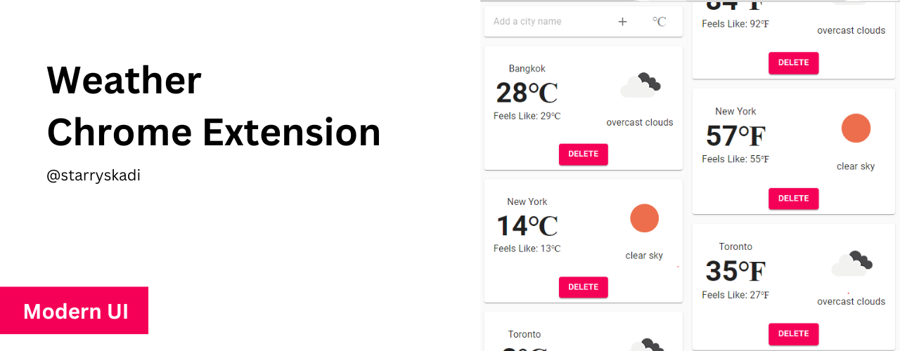

# Weather - Chrome Extension

This is a simple and user-friendly weather extension for Google Chrome that displays current weather conditions, temperature, and other relevant information for your selected location. It integrates with the OpenWeather API to provide accurate and up-to-date weather data.

You can choose between metric and imperial units, depending on your preferences. T

To get started, simply enter your api key in options page and location in the extension's popup menu and the weather information will automatically update based on your selection.

## Features:

Real-time weather updates
Temperature displayed in either Celsius or Fahrenheit

## Loading The Chrome Extension

1. Run `npm install` and `npm build`
2. Open Chrome and navigate to `chrome://extensions/`
3. Toggle on `Developer mode` in the top right corner
4. Click `Load unpacked`
5. Select the entire `dist` folder

## Usage:

Click on the extension icon in your browser's toolbar
Enter your api key in options page
Enter your location in the popup menu
The weather information will automatically update based on your selection

Note: This extension requires an OpenWeather API key, which you can obtain for free at https://openweathermap.org/api.
